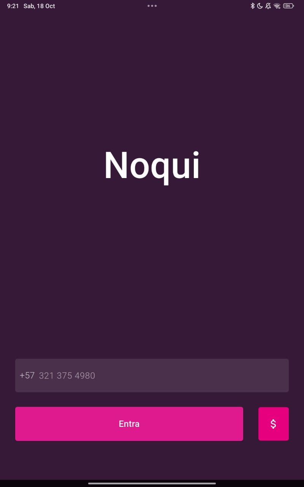
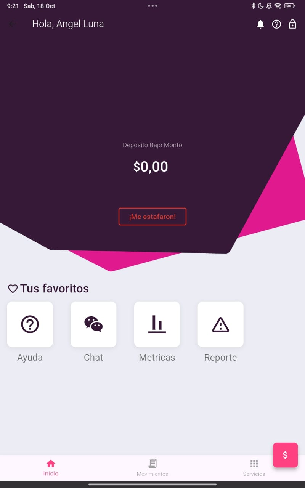
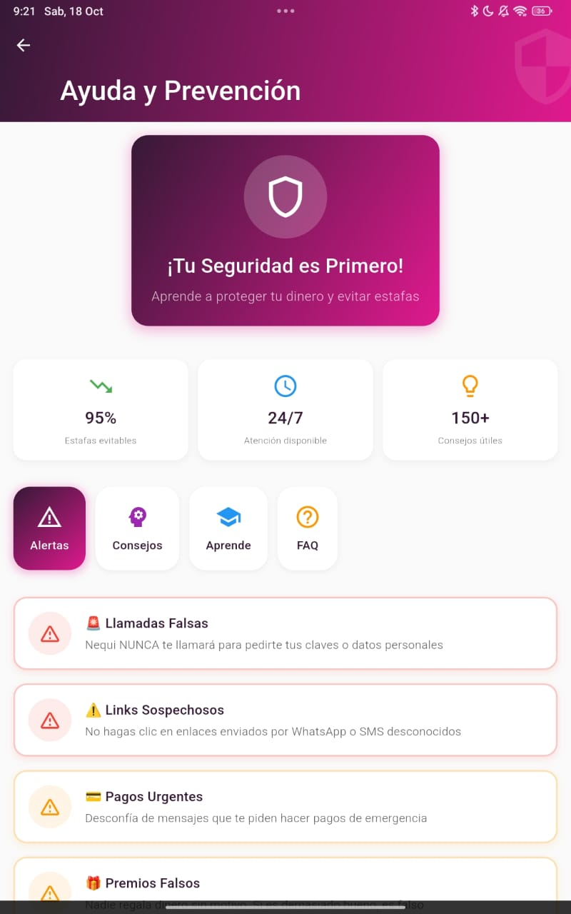
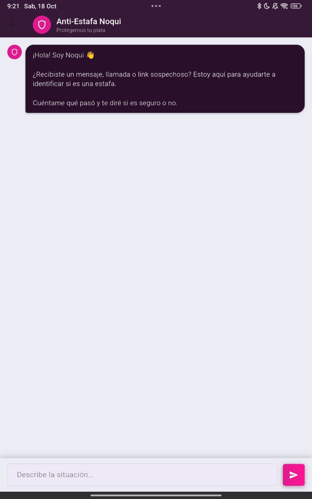
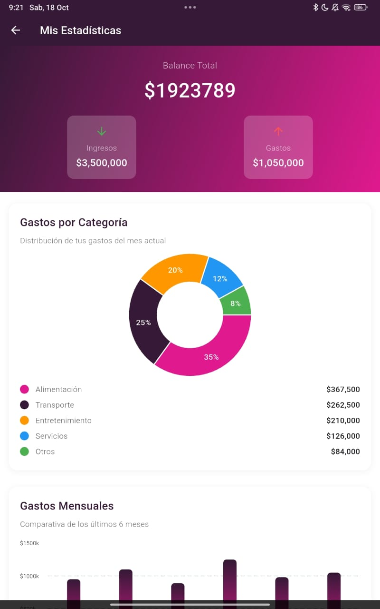
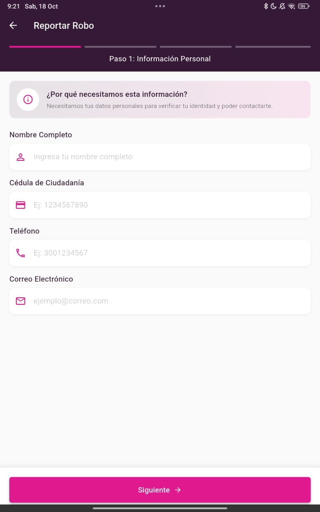

# 🛡️ Noqui Scam Shield - App Anti-Estafas

<div align="center">


**Una aplicación móvil diseñada para protegerte de estafas en Nequi mediante inteligencia artificial y educación financiera.**

[Instalación](#-instalación) • [Características](#-características) • [Configuración](#️-configuración-de-deepseek-api) • [Capturas](#-capturas-de-pantalla)

</div>

---

## 📋 Tabla de Contenidos

- [Requisitos Previos](#-requisitos-previos)
- [Instalación de Flutter](#-instalación-de-flutter)
- [Configuración del Proyecto](#-configuración-del-proyecto)
- [Emular un Dispositivo](#-emular-un-dispositivo)
- [Sobre el Proyecto](#-sobre-el-proyecto)
- [Configuración de DeepSeek API](#️-configuración-de-deepseek-api)
- [Estructura de Pantallas](#-estructura-de-pantallas)
- [Estructura del Proyecto](#-estructura-del-proyecto)

---

## 🚀 Requisitos Previos

Antes de comenzar, asegúrate de tener instalado:

- **Sistema Operativo**: Windows 10/11, macOS, o Linux
- **Espacio en disco**: Mínimo 2.5 GB
- **RAM**: Mínimo 4 GB (recomendado 8 GB)
- **Git**: [Descargar Git](https://git-scm.com/downloads)

---

## 📱 Instalación de Flutter

### Windows

1. **Descargar Flutter SDK**
   ```bash
   # Descarga desde: https://docs.flutter.dev/get-started/install/windows
   # O usando Git:
   git clone https://github.com/flutter/flutter.git -b stable
   ```

2. **Agregar Flutter al PATH**
   - Abre "Editar variables de entorno del sistema"
   - Edita la variable `Path`
   - Agrega la ruta: `C:\src\flutter\bin`

3. **Verificar instalación**
   ```bash
   flutter doctor
   ```

### macOS

1. **Descargar Flutter SDK**
   ```bash
   cd ~/development
   git clone https://github.com/flutter/flutter.git -b stable
   ```

2. **Agregar Flutter al PATH**
   ```bash
   echo 'export PATH="$PATH:$HOME/development/flutter/bin"' >> ~/.zshrc
   source ~/.zshrc
   ```

3. **Instalar Xcode** (para iOS)
   ```bash
   sudo xcode-select --switch /Applications/Xcode.app/Contents/Developer
   sudo xcodebuild -runFirstLaunch
   ```

4. **Verificar instalación**
   ```bash
   flutter doctor
   ```

### Linux

1. **Descargar Flutter SDK**
   ```bash
   cd ~/development
   git clone https://github.com/flutter/flutter.git -b stable
   ```

2. **Agregar Flutter al PATH**
   ```bash
   echo 'export PATH="$PATH:$HOME/development/flutter/bin"' >> ~/.bashrc
   source ~/.bashrc
   ```

3. **Instalar dependencias**
   ```bash
   sudo apt-get update
   sudo apt-get install curl git unzip xz-utils zip libglu1-mesa
   ```

4. **Verificar instalación**
   ```bash
   flutter doctor
   ```

---

## 📲 Emular un Dispositivo

### Android Emulator

1. **Instalar Android Studio**
   - Descarga desde: https://developer.android.com/studio
   - Instala Android SDK y Android SDK Platform-Tools

2. **Crear un dispositivo virtual (AVD)**
   ```bash
   # Abre Android Studio
   # Ve a: Tools > Device Manager > Create Device
   # Selecciona un dispositivo (ej: Pixel 6)
   # Descarga una imagen del sistema (ej: Android 13)
   # Crea el AVD
   ```

3. **Iniciar el emulador**
   ```bash
   flutter emulators --launch <emulator_id>
   # O desde Android Studio: Device Manager > ▶️ Play
   ```

### iOS Simulator (solo macOS)

1. **Abrir el simulador**
   ```bash
   open -a Simulator
   ```

2. **Seleccionar dispositivo**
   - En Simulator: File > Open Simulator > iPhone 14 Pro

3. **Ejecutar la app**
   ```bash
   flutter run
   ```

### Dispositivo Físico

#### Android
1. Activa "Opciones de desarrollador" en tu dispositivo
2. Habilita "Depuración USB"
3. Conecta el dispositivo con USB
4. Verifica la conexión:
   ```bash
   flutter devices
   ```

#### iOS
1. Conecta tu iPhone/iPad
2. Confía en el ordenador desde el dispositivo
3. En Xcode: Window > Devices and Simulators
4. Registra el dispositivo

---

## 🛠️ Configuración del Proyecto

1. **Clonar el repositorio**
   ```bash
   git clone https://github.com/angelluna03030/Noqui
   cd noqui
   ```

2. **Instalar dependencias**
   ```bash
   flutter pub get
   ```

3. **Verificar que no hay errores**
   ```bash
   flutter doctor -v
   flutter analyze
   ```

4. **Ejecutar la aplicación**
   ```bash
   # En modo debug
   flutter run

   # En modo release
   flutter run --release

   # Seleccionar dispositivo específico
   flutter run -d <device_id>
   ```

---

## 💡 Sobre el Proyecto

**Noqui** es una aplicación móvil desarrollada en Flutter que tiene como objetivo principal **proteger a los usuarios de Nequi contra estafas digitales**. 

### Problemática
Las estafas digitales en aplicaciones de pagos como Nequi han aumentado significativamente en Colombia, afectando a miles de usuarios que pierden su dinero debido a técnicas de ingeniería social, phishing y fraudes financieros.

### Solución
Esta app combina:
- 🤖 **Inteligencia Artificial (DeepSeek)**: Chatbot que analiza conversaciones sospechosas en tiempo real
- 📚 **Educación**: Recursos y guías para identificar estafas
- 📊 **Métricas**: Visualización de estadísticas sobre estafas reportadas
- 🚨 **Sistema de Reportes**: Canal directo para denunciar fraudes

---

## 🔑 Configuración de DeepSeek API

### 1. Obtener API Key

1. Visita: https://platform.deepseek.com/
2. Crea una cuenta o inicia sesión
3. Ve a: **API Keys** > **Create new secret key**
4. Copia tu API key (guárdala en un lugar seguro)

### 2. Configurar en el Proyecto

1. **primero descarga la dependencia http** 
   ```bash
   # En la raíz del proyecto
   
   flutter pub add http
   ```

2. **Importa la dependencia**
   ```
   import 'package:http/http.dart' as http;
   ```

3. **Utliza el api key en tu código**
   ```chat
   # En chat.dart
     final String _apiKey = 'aqui va tu apikey de deepseek';
     
   ```


### 3. Integración con DeepSeek

```dart
// lib/services/deepseek_service.dart
     final String _apiKey = 'aqui va tu apikey de deepseek';
Future<String> _callDeepSeekAPI(String userMessage) async {
    final url = Uri.parse('https://api.deepseek.com/v1/chat/completions');

    final response = await http.post(
      url,
      headers: {
        'Content-Type': 'application/json',
        'Authorization': 'Bearer $_apiKey',
      },
      body: jsonEncode({
        'model': 'deepseek-chat',
        'messages': [
          {'role': 'system', 'content': _systemPrompt},
          {'role': 'user', 'content': userMessage},
        ],
        'temperature': 0.7,
        'max_tokens': 500,
      }),
    );

    if (response.statusCode == 200) {
      final data = jsonDecode(utf8.decode(response.bodyBytes));
      return data['choices'][0]['message']['content'];
    } else {
      throw Exception('Error al comunicarse con DeepSeek: ${response.body}');
    }
  }
```

---

## 📱 Estructura de Pantallas

### 🔐 1. Login Screen

<div align="center">
  
</div>

**Características:**
- Inicio de sesión simplificado
- Solo requiere número de celular colombiano
- Validación de formato: `+57 3XX XXX XXXX`
- Animación de entrada suave

**Ubicación**: `lib/pages/entrada.dart`

---

### 🏠 2. Pantalla Principal (Home)

<div align="center">
  
</div>

**Características:**
- **Animaciones interactivas**: Iconos con efecto de hover y transiciones suaves
- **4 Módulos principales**:
  
  #### 1️⃣ Ayuda y Prevención 🆘
  
  
  - Artículos educativos sobre estafas comunes
  - Guías de prevención
  - Tips de seguridad
  - Casos reales de estafas
  
  #### 2️⃣ Chatbot IA (DeepSeek) 🤖
  
  
  - Análisis de mensajes sospechosos en tiempo real
  - Conversación natural con IA
  - Recomendaciones personalizadas
  - Detección de patrones de fraude
  
  #### 3️⃣ Métricas y Estadísticas 📊
  
  
  - Gráficas de estafas reportadas por tipo
  - Tendencias mensuales
  - Zonas de mayor riesgo
  - Estadísticas generales
  
  #### 4️⃣ Reportar Estafa 🚨
  
  
  - Formulario de reporte rápido
  - Adjuntar capturas de pantalla
  - Descripción detallada del incidente
  - Envío directo a autoridades

**Ubicación**: `lib/screens/home_screen.dart`

---

## 📁 Estructura del Proyecto

```
noqui/
│
├── assets/                      # 🖼️ Recursos multimedia
│   ├── login_screen.jpeg
│   ├── home_screen.jpeg
│   ├── help_icon.jpeg
│   ├── chatbot_icon.jpeg
│   ├── metrics_icon.jpeg
│   ├── report_icon.jpeg
│   └── logo.jpg
│
├── lib/
│   ├── main.dart    # 🚪 Punto de entrada
|   ├── rutas.dart               # 🚪 Rutas globales
│   │
│   ├── ui/                # 📱 Pantallas
│   │   ├── chat
│   │   ├── estadisticas
│   │   ├── home
│   │   ├── help
│   │   └── Report
│   │
│   │
│   ├── widgets/                # 🧩 Componentes reutilizables
│   │   ├── botondealarma.dart
│   │   ├── Countup.dar.dart
│   │   
│   │
│   └── utils/                  # 🛠️ Utilidades
│      
│      
│       
│
├── test/                       # 🧪 Pruebas
│   └── widget_test.dart
│
├
├── .gitignore
├── pubspec.yaml               # 📦 Dependencias
└── README.md                  # 📖 Este archivo
```

---

## 📦 Dependencias Principales

```yaml
dependencies:
  flutter:
    sdk: flutter


  # The following adds the Cupertino Icons font to your application.
  # Use with the CupertinoIcons class for iOS style icons.
  cupertino_icons: ^1.0.8
  ionicons: ^0.2.2
  intl: ^0.20.2
  fl_chart: ^1.1.1
  http: ^1.5.0
  url_launcher: ^6.3.2

```

---

## 🎨 Capturas de Pantalla

<div align="center">


| Login | Home | Chatbot | Ayuda | Métricas | Reportar |
|:-----:|:----:|:-------:|:-----:|:--------:|:--------:|
|  |  |  |  |  |  |

</div>

---

## 🚀 Comandos Útiles

```bash
# Ejecutar en modo debug
flutter run

# Ejecutar en modo release (más rápido)
flutter run --release

# Ver dispositivos disponibles
flutter devices

# Limpiar build cache
flutter clean

# Actualizar dependencias
flutter pub upgrade

# Generar APK para Android
flutter build apk --release

# Generar IPA para iOS
flutter build ios --release

# Analizar código
flutter analyze

# Ejecutar tests
flutter test

# Ver logs en tiempo real
flutter logs
```

---

## 🤝 Contribuir

¿Quieres mejorar esta app? ¡Las contribuciones son bienvenidas!

1. Fork el proyecto
2. Crea una rama para tu feature (`git checkout -b feature/AmazingFeature`)
3. Commit tus cambios (`git commit -m 'Add some AmazingFeature'`)
4. Push a la rama (`git push origin feature/AmazingFeature`)
5. Abre un Pull Request

---

## 📄 Licencia

Este proyecto está bajo la Licencia MIT. Ver el archivo `LICENSE` para más detalles.

---

## 👨‍💻 Autor

**Tu Nombre**
- GitHub: [@angelluna03030](https://github.com/angelluna03030)
- Email: angelstivengarcialuna@gmail.com

---

## 🙏 Agradecimientos

- [Flutter Team](https://flutter.dev) - Por el increíble framework
- [DeepSeek](https://www.deepseek.com) - Por la API de IA
- Comunidad de Flutter en Colombia 🇨🇴

---

<div align="center">

**⭐ Si este proyecto te ayuda, considera darle una estrella ⭐**

Hecho con ❤️ en Colombia 🇨🇴

</div>